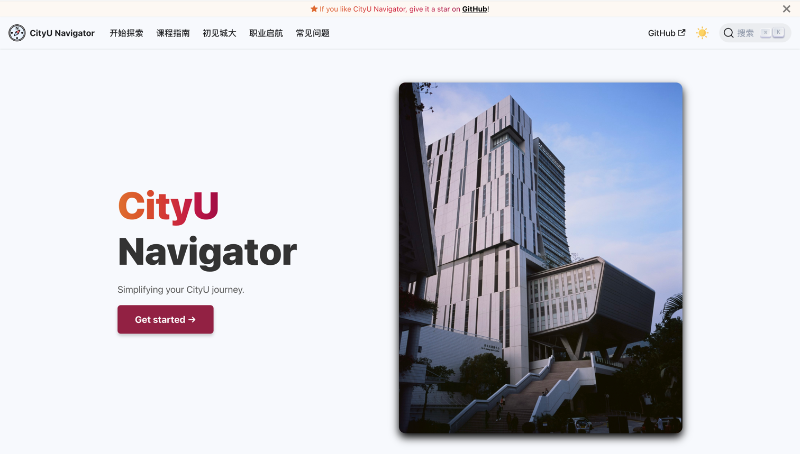

<!-- PROJECT SHIELDS -->

    
    
    
    
    
    
    <!---->
    
    
    
    
    

<!-- PROJECT LOGO -->

  

<h2 align="center">CityU 手册</h3>

  

    一站式 香港城市大学 学术与生活指南，提供详细的课程信息、学生评价、校园攻略及职业资源。
     
    <a href="https://cityuhk.cn/start"><strong>开始探索 »</strong></a>
     
     
    <a href="https://github.com/penjc/CityU/issues/new?labels=enhancement&template=feature-request---.md">功能建议</a>    
    &middot;
    <a href="https://github.com/penjc/CityU/issues/new?labels=bug&template=bug-report---.md">报告 Bug</a>
  

<!-- TABLE OF CONTENTS -->

  
📋 目录

  <ol>
    <li><a href="#-关于本站">🧐 关于本站</a></li>
    <li><a href="#-参与贡献">🤝 参与贡献</a></li>
    <li><a href="#-许可证">📜 许可证</a></li>
    <li><a href="#-联系我们">📬 联系我们</a></li>
    <li><a href="#-贡献者">👨‍💻 贡献者</a></li>
  </ol>

---

## 🧐 关于本站

**CityU 手册** 是一个专为 `City University of Hong Kong` 学生打造的开源项目。

**内容概览**
- 🏫 **[初见城大](https://cityuhk.cn/docs/welcome/intro)**：城大`全面指南`，涵盖新生注册、校园设施和学生资源等关键信息，轻松融入城大生活。
- 📘 **[课程指南](https://cityuhk.cn/docs/courses/intro)**：深入了解最新的 课程结构、学习内容和课程目标，掌握详细的考试信息和 `真实学生评价`。
- 💼 **[职业启航](https://cityuhk.cn/docs/career/intro)**：提供丰富的 `职业资源`，帮助学生掌握行业机会、就业准备和 `同学分享`，助力顺利进入职场。
- ❓ **[常见问题](https://cityuhk.cn/docs/faq/intro)**：一站式解答学生 `常见疑问`，提供详细解答和实用资源。

<a href="#readme-top">回到顶部</a>

## 🤝 参与贡献

贡献是开源社区的核心！我们欢迎一切形式的贡献！

请参考 [贡献指南](https://cityuhk.cn/contributing) 开始您的贡献。

1. Fork 项目
2. 新建分支：`git checkout -b feature/YourFeature`
3. 提交更改：`git commit -m 'Add YourFeature'`
4. 推送分支：`git push origin feature/YourFeature`
5. 发起 Pull Request

  
🖋 可以为 CityU 手册贡献的内容

#### 📚 **内容改进**
- 提交学生评价、生活贴士或职业经验分享。
- 增加或修正课程信息、校园指南和职业资源等内容。
- 将内容翻译为其他语言，支持更多国际学生。

#### 🎨 **设计支持**
- 改进页面布局与用户界面，使内容更直观。
- 添加高质量图片、图标或其他视觉元素。

#### 🖥 **功能优化**
- 开发或优化功能，如搜索工具、导航栏或数据展示。
- 修复 Bug，提升网站性能和用户体验。

#### 💬 **建议与反馈**
- 提出新模块或功能的建议。
- 分享使用体验，帮助改进站点内容与功能。

<a href="#readme-top">回到顶部</a>

## 📜 许可证

本项目的代码基于 [MIT License](https://opensource.org/licenses/MIT) 许可协议，内容部分遵循 [CC-BY-SA 4.0](https://creativecommons.org/licenses/by-sa/4.0/) 许可协议。

- **MIT License**：适用于本项目的代码，允许您自由使用、修改和分发，只需保留原始版权声明。
- **CC-BY-SA 4.0**：适用于本项目的所有正文内容，您可以自由复制、修改和分发这些内容，只要提供署名（**CityU 手册**），引用内容和链接的知识产权归原出处作者，并且在衍生作品上使用相同的许可证。

<a href="#readme-top">回到顶部</a>

## 📬 联系我们

如果您在使用中遇到问题，或者有任何反馈，欢迎通过以下方式与我们取得联系：

<a href="#readme-top">回到顶部</a>

## 👨‍💻 贡献者

感谢所有为 **CityU 手册** 作出贡献的人！[【参与贡献】](https://cityuhk.cn/contributing)

<a href="#readme-top">回到顶部</a>

